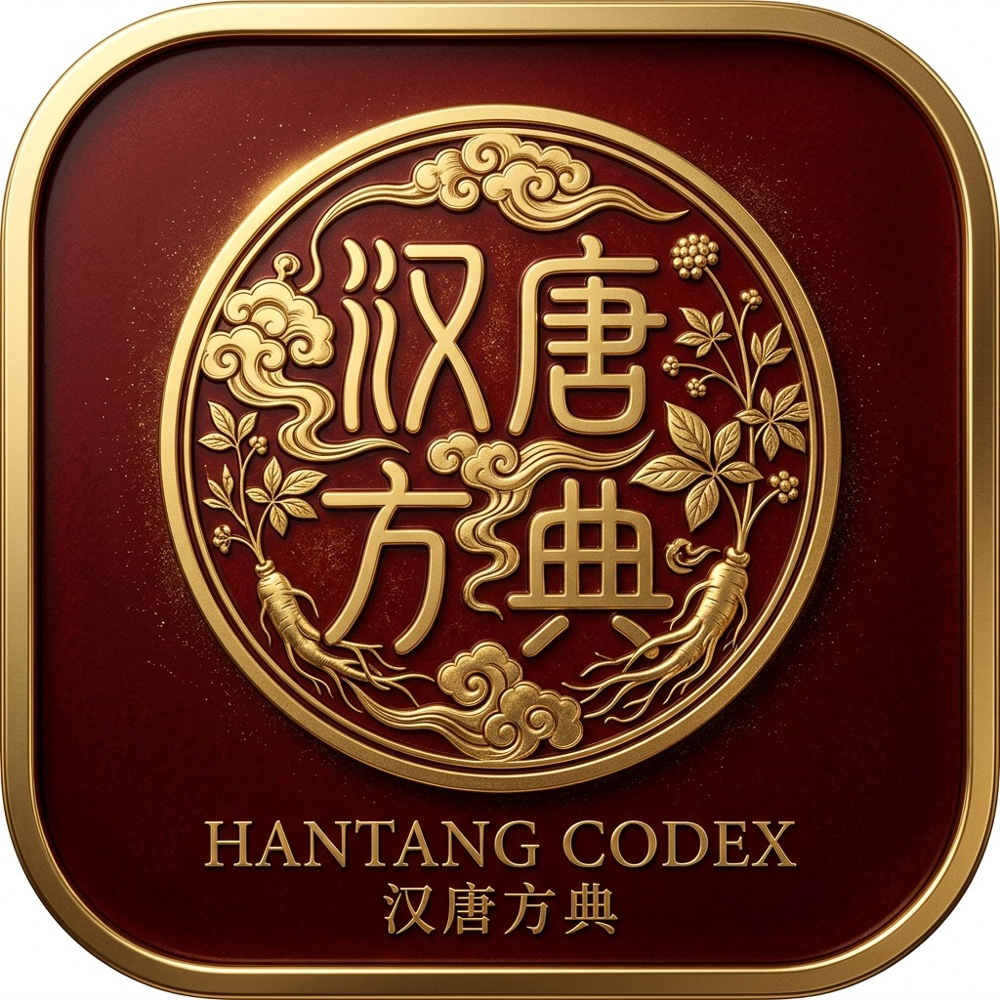

# 汉唐方典 · HanTang Codex
### 倪海厦人纪经方智能检索与临床经方决策系统
#### An Intelligent Classical Chinese Medicine Codex & Clinical Decision Suite

  <a href="./README.md">🇺🇸 English</a> · <b>🇨🇳 简体中文</b>

  
  
  
  

  <b>「法度遵仲景 · 心法承倪师」</b> 
  收录 391 首张仲景伤寒金匮经方与倪海厦 HT-1~100 临床验方，赋能中医人纪学者、经方爱好者与临床中医师。

---

[🚀 立即在线体验 (Live Official Web)](https://fangji-2oh.pages.dev/) · [⭐ 欢迎点 Star 收藏](#-支持与点赞) · [✨ 核心功能亮点](#-核心功能亮点) · [⚖️ 经方鉴别矩阵](#3--经方横向深度鉴别与病机演变透视矩阵) · [🔒 版权与商务](#-商业授权与版权保护声明)

---

## 📖 关于项目 (About HanTang Codex)

**「汉唐方典」(HanTang Codex)** 是面向经方研习者、临床中医师与中医爱好者的**经方智能检索、多维复合辨证与临床药笺生成系统**。

项目深度整合了东汉医圣张仲景《伤寒杂病论》（《伤寒论》《金匮要略》）正统条文，以及当代经方大家**倪海厦老师（Ni Haixia）**《人纪》讲义与汉唐临床方剂核心心法，致力于提供严谨、系统、直观的经方数字化查询与辨证决策支持。

---

## ✨ 核心功能亮点 (Key Features)

### 1. 🔍 全文智能模糊与中英双语检索
- **391 首正统经方全收录**：涵盖太阳、阳明、少阳、太阴、少阴、厥阴六经辨证方剂与倪师临床经验方。
- **通俗白话主治提炼**：剔除晦涩术语，每首方剂均提炼标准 `【治疗什么】` 通俗痛点说明与现代适应证。
- **古籍原文溯源**：提供原著条文与出处精准对照。

### 2. 🎯 8 大系统 50+ 现代症状复合加权辨证雷达
- **多选组合模式**：支持自由组合勾选 3~5 项复合身体感受（如：*手脚冰凉 + 腹痛腹泻 + 失眠*）。
- **智能加权契合度算法**：实时计算全库契合度百分比（`🔥 100% 契合` / `🎯 75% 契合`），精准锁定主证并降序推荐最佳对症方。

### 3. ⚖️ 经方横向深度鉴别与病机演变透视矩阵（核心亮点）
- **类方横向深度对比**：支持任意勾选 2~4 首易混淆类方（如：*桂枝加附子汤 vs 芍药甘草汤 vs 芍药甘草附子汤 vs 甘草附子汤*）。
- **药材增减透视表**：全息列出共用基底药（`【共用基底】`）与特色加减药（`【加减药】`），公制克重差异一目了然。
- **🎯 核心辨证眼目**：提炼每个方子的唯一硬核决断指标。
- **👤 典型患者画像**：用通俗的生活化场景（如：“退烧后汗止不住”、“半夜小腿抽筋”、“关节碰都不能碰”），让您一眼对号入座。
- **🔘 顶部一键问诊决断向导**：根据当下最突出感受一键点击，系统自动高亮锁定最佳对症方。

### 4. 📜 规范化经典药笺生成与多渠道导出（Prescription Export）
- **规范化药笺结构**：包含方剂出处、处方日期与规范药单排版。
- **三列药学学名表格**：中文药名、声调拼音、正统药学拉丁植物学名（*Pharmaceutical Latin*）及精准公制克重（`g`）。
- **三段式煎服指南**：准备（`PREPARE`）、煎煮（`BOIL`）、温服（`ADMINISTER`）图形化标准指南。
- **全渠道一键导出**：支持高清药笺图片长按保存发微信、A4 极简打印与纯文本药单复制。

### 5. ⚠️ 经方配伍安全与十八反十九畏自检引擎
- **禁忌规则自检**：自动筛查甘草反甘遂/海藻、乌头附子反半夏/瓜蒌等经典反药。
- **特殊人群预警**：含附子、大黄、芒硝、水蛭等药材时，自动提示孕妇及虚弱慎用。
- **特殊煎法提点**：麻黄先煮去沫、生石膏布包绵裹、芒硝烊化冲服、生附子文火久煎。

---

## 🗺️ 路线图规划 (Roadmap)

- [x] **v1.0**：391 首经方全文搜索与中英双语国际化
- [x] **v1.5**：8 大系统现代症状矩阵与云端统一用户体系
- [x] **v2.0**：规范药笺导出、经方横向鉴别矩阵、多症状雷达与配伍禁忌引擎
- [ ] **v2.5 (VIP)**：个人专属云端药箱、服药调养日记、自定义药材克重调配
- [ ] **v3.0 (AI)**：倪师人纪 AI 经方辨证 Copilot（自然语言症状推导六经病机）

---

## ⭐ 支持与点赞 (Support & Star)

如果您觉得「汉唐方典」对您的经方研习、临床诊疗或健康管理有所启发与帮助：

- 🌟 请在右上角为本项目点亮一颗 **Star**，这是对我们最大的鼓励！
- 📢 欢迎分享给身边的中医同道、经方爱好者与亲友。
- 💬 如果您有任何功能建议或新需求，欢迎在 [Issues](https://github.com/orikami048/hantang-codex/issues) 中留言反馈。

---

## 🔒 商业授权与版权保护声明 (Commercial Notice)

本项目核心算法、架构逻辑、经方辨证矩阵数据库及品牌标识受知识产权及版权法保护。

- **商业专有许可证**：本项目采用 **[Commercial Proprietary Software License](./LICENSE)**。
- **使用权限**：允许个人非商业学术研习、研究交流与在线体验。
- **禁止行为**：**严禁任何未经书面授权的代码抄袭、二次打包、转售、商业部署或镜像站点搭建**。
- **维权声明**：任何侵权抄袭行为将直接依照 DMCA 法案提请下架并保留法律追责权利。

如需商业合作、企业采购或 API 授权对接，请通过 GitHub 或官方渠道联系作者。

---

  Copyright © 2026 HanTang Codex (汉唐方典). Crafted with reverence for Classical Chinese Medicine. 
  Online Web Application: <a href="https://fangji-2oh.pages.dev/">https://fangji-2oh.pages.dev/</a>

